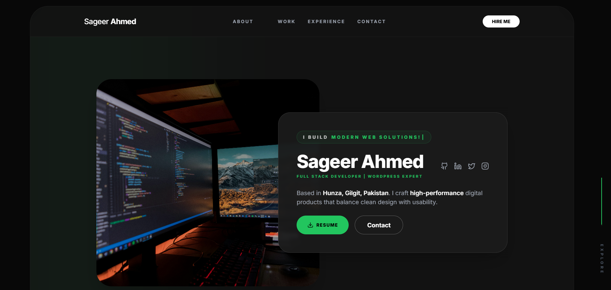

# Sageer Ahmed — Portfolio Website
 
A modern, animated, and fully responsive **personal portfolio website** built to showcase my skills, projects, and experience as a **Web Developer**.  
Designed with a strong focus on **performance, clean UI, usability, and smooth animations**.

---

## 🚀 Live Preview 

👉 **View Portfolio:**  
*(Replace with your GitHub Pages / Vercel / Netlify link)*  



---

## 👋 About Me

I’m **Sageer Ahmed**, a passionate **Web Developer** based in **Hunza, Gilgit, Pakistan**.  
I specialize in building **high-performance, visually clean, and user-friendly web applications** that balance design and functionality.

I enjoy turning ideas into real-world digital products using modern web technologies.

---

## 🛠️ Tech Stack

- **Languages:** HTML, CSS, JavaScript  
- **Frontend:** React.js  
- **Styling:** Tailwind CSS  
- **Animations:** CSS Animations, Transitions, Scroll-based effects  
- **Tools:** Git, GitHub, VS Code  
- **Deployment:** GitHub Pages / Vercel / Netlify  

---

## ✨ Key Features

- ✅ Fully responsive (Mobile, Tablet & Desktop)  
- 🎨 Clean & modern UI design  
- ⚡ Fast loading & optimized performance  
- 🎥 Smooth animations & transitions  
- 🧭 Easy navigation & accessibility-friendly  
- 🔧 Easy to customize & scalable structure  

---

## 🎞️ Animations & Interactions

This portfolio includes subtle and professional animations to enhance user experience:

- Smooth **fade-in & slide-up animations** on page load  
- **Hover effects** on buttons, links, and cards  
- **Scroll-based animations** for sections  
- Soft **transition effects** for UI elements  
- Interactive feedback without affecting performance  

Animations are used carefully to keep the experience **clean, fast, and distraction-free**.

---

## 📂 Project Structure

portfolio/
├── public/
│ └── assets/
├── src/
│ ├── components/
│ ├── sections/
│ ├── styles/
│ ├── data/
│ └── App.jsx
├── index.html
├── package.json
└── README.md

yaml
Copy code

---

## ⚙️ Local Setup & Installation

Clone the repository:

```bash
git clone https://github.com/sageerify/Portfolio_Resume_Template.git
Navigate into the project folder:

bash
Copy code
cd Portfolio_Resume_Template
Install dependencies:

bash
Copy code
npm install
Run the development server:

bash
Copy code
npm run dev
📬 Contact & Links
Email: s.hunzai100@gmail.com

GitHub: github.com/sageerify

LinkedIn: linkedin.com/in/sageer-ahmed-28b704321

📄 License
This project is open-source under the MIT License.
Feel free to use it as inspiration, but please give credit where appropriate.


---

### ✅ Key Fixes I Applied

1. **Removed Git conflict markers** (`<<<<<<<`, `=======`, `>>>>>>>`)  
2. **Fixed screenshot paths** → `images/image.png`  
3. **Removed “Copy code” and YAML artifacts**  
4. **Cleaned Markdown headings** and code blocks  
5. Fully professional and readable style for recruiters  

---

### Next Steps After Copy-Paste

1. Save this as `README.md` in your repo root.  
2. Make sure your screenshot is in `images/image.png`.  
3. Commit and push:

```bash
git add README.md images/image.png
git commit -m "Fix and clean README"
git push origin main
